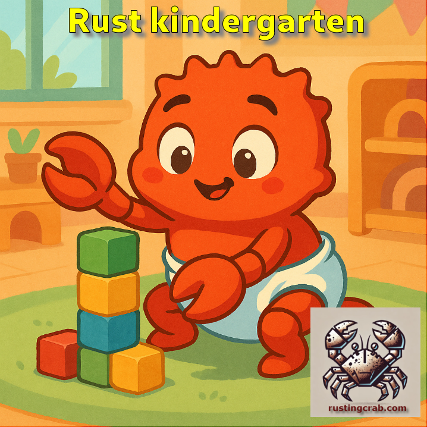

---

[**Cleuton Sampaio**](https://linkedin.com/in/cleutonsampaio)

[**Veja no GitHub**](https://https://github.com/cleuton/rustingcrab/tree/main/rustkindergarten)

# O jardim da infância

Esse é um curso prático, para te dar "fluência" em **Rust**. O que isso quer dizer? Um dev tem "fluência" quando consegue escrever código sem ter que ficar consultado fontes externas, *auto-complete* ou assistentes de **IA**. 

É claro que você fará isso, pois todos fazem. E ferramentas modernas como o **VS Code** já vêm com assistência embutida. Mas e em uma entrevista de emprego do tipo *white board**? O cara te mostra uma tela em branco (ou pede para abrir o "Bloco de notas") e escrever código? E outro caso, você quer agilizar sua programação sem perder tempo em "colar" o básico? 

> **Atenção:** Este curso não visa boas práticas em **Rust** e nem soluções otimizadas. Muita coisa que verá aqui é bastante simples e até **ingênua**, pois o objetivo é **FAZER VOCÊ SAIR DO ZERO EM RUST**, ok? Se você já fez algum curso de Rust, ou tem uma ideia básica, este curso vai te dar agilidade ao programar. Se nada conhece, vai aprender o básico (bem básico mesmo).

Já tem o [**Rust instalado?**](./instalar_rust.md).

Então vamos lá... 

- [**ZERO - AULA ZERO EM VÍDEO - COMECE AQUI**](https://youtu.be/2awLyHNI3T8).
- [**1 - Tia, posso fazer xixi?**: Estrutura, funções, tipos escalares, referências](./licoes/licao1%20-%20do%20inicio%20bebe/). [**--> vídeo**](https://youtu.be/4Pp4zsnziDU).
- [**2 - Olha, Mamãe: Sem as mãos**: Tipos compostos, ownership, borrow](./licoes/licao2%20-%20sem%20as%20mãos%20-%20tipos%20compostos/). [**--> vídeo**](https://youtu.be/rxw6Q_Cm84U).
- [**3 - Onde a criança chora e a mãe não vê**: Array, slice e vec](./licoes/licao3%20-%20%20onde%20a%20criança%20chora%20e%20a%20mãe%20não%20vê%20-%20array%20-%20slice%20-%20vec/). [**--> vídeo**](https://youtu.be/GxQMSSvTkMM).
- [**4 - Mamãe eu quero mamar**: Structs](./licoes/licao4%20-%20Mamae%20eu%20quero%20mamar%20-%20structs/). [**--> vídeo**](https://youtu.be/ThUNWjLOkac).
- [**5 - Cadê meu suquinho?**: Métodos](./licoes/licao5%20-%20Cade%20meu%20suquinho%20-%20metodos/). [**--> vídeo**](https://youtu.be/cDkfrpKciH8?si=QT00U5ICzt-285C8).
- [**6 - Fiz dodói**: Traits](./licoes/licao6%20-%20Fiz%20dodói%20-%20Traits/). [**--> vídeo**](https://youtu.be/x1EWCiXkBe0).
- [**7 - Talquinho no B**: Enums](./licoes/licao7%20-%20Enums/). [**--> vídeo**](https://youtu.be/_S8jLALxGBU).
- [**8 - Vou esconder isso do bebê**: Encapsulamento](./licoes/licao8%20-%20Vou%20esconder%20isso%20do%20bebê%20-%20encapsulamento/). [**--> vídeo**](https://youtu.be/1aMsxI7IdVQ?si=X51g8QKRvP1ZGzkf).
- [**9 - Tendi não tia**: Generics](./licoes/licao9%20-%20Tendi%20não%20fessora%20-%20Generics/). [**--> vídeo**](https://youtu.be/whyslLGOLhU?si=hwdGs0X8dAaDOFlk).
- [**10 - Cadê a mamãe?**: Lifetime](./licoes/licao10%20-%20cadê%20a%20mamãe%20-%20lifetime/). [**--> vídeo**](https://youtu.be/niU2Cg6lTWk?si=6ODhjlepUAHpiiT_).
- [**11 - "b" com "a" faz "ba"** Command-line args e arquivos](./licoes/licao11%20-%20b%20com%20a%20faz%20ba%20-%20command-line%20args/).
- [**12 - Chamêgo de Vó** Cargo, dependências e `use`](./licoes/licao12%20-%20Cargo,%20dependencies%20e%20use/).
- [**13 - Devê di casa** Exercícios para a mente e o corpo](./licoes/licao13%20-%20devê%20di%20casa%20-%20exercicios%20para%20a%20mente%20e%20o%20corpo/).

Se conseguiu terminar tudo, parabéns! Já vai ao banheiro sem ajuda!

