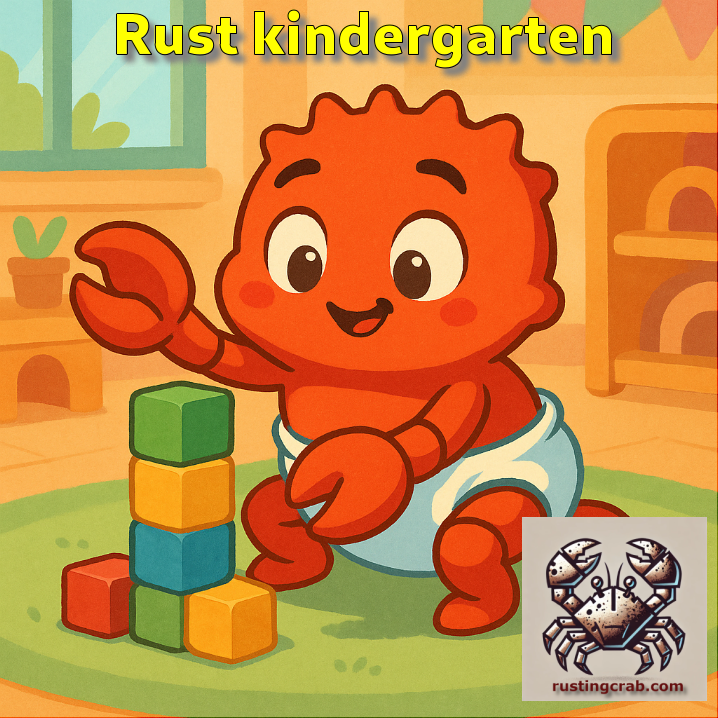

---

[**Cleuton Sampaio**](https://linkedin.com/in/cleutonsampaio)

[**Veja no GitHub**](https://https://github.com/cleuton/rustingcrab/tree/main/rustkindergarten)

[**MENU do curso**](../../README.md)

# Mamãe, eu quero mamar: Structs

Para começar, [**já instalou o Rust?**](https://www.mycompiler.io/pt/new/rust).

Como diria o Mestre Po, do seriado "Kung Fu": "Paciência, pequeno gafanhoto", **<u>Rust não é orientada a objetos</u>**> **Structs** não são classes!

> Em **Rust**, `structs` são usadas para agrupar dados relacionados em um único tipo, como um nome, idade ou coordenadas. Elas definem a forma dos dados, mas não misturam dados com comportamento por padrão, ao contrário das classes em linguagens orientadas a objetos, como **Java** ou **Python**. Em Rust, os métodos são adicionados às structs por meio de `impl` blocks, mas essa separação é intencional: a linguagem foca em composição de comportamento através de funções e traits, **<u>não em herança ou estado encapsulado</u>**. Assim, structs em Rust são mais como "caixas de dados" com funcionalidades opcionais, enquanto classes normalmente combinam dados, métodos e herança tudo em um só lugar.


## Exercícios

### 1 Crie uma struct para armazenar os dados de uma pessoa

Se você estivesse usando **Javascript**, faria algo assim: 

```javascript
// Representação de uma Pessoa em JavaScript
const pessoa = {
    id: 5,
    nome: "Fulano",
    email: "fulano@teste.com"
};

// Exibe o objeto no console (equivalente a println! com {:?})
console.log("Pessoa:", pessoa);
```

E se fosse **Python**, talvez algo assim: 

```python
# Representação de uma Pessoa em Python
class Pessoa:
    def __init__(self, id: int, nome: str, email: str):
        self.id = id
        self.nome = nome
        self.email = email

    def __repr__(self):
        return f"Pessoa(id={self.id}, nome='{self.nome}', email='{self.email}')"

# Criação de uma instância de Pessoa
p = Pessoa(
    id=5,
    nome="Fulano",
    email="fulano@teste.com"
)

# Exibe a pessoa (equivalente a println!("Pessoa: {:?}", p))
print(f"Pessoa: {p}")
```

Eu diria que para criar uma struct em Rust, você combina Javascript com Python, usando a palavra-chave `struct` em vez de `class`. Por exemplo, uma struct para armazenar coordenadas de pontos em um game seria: 

```rust
struct Ponto {
    x: i32,
    y: i32,
}

fn main() {
    let p = Ponto{x: 10, y: 100};
}
```

Só que teremos: `id`, `nome` e `email`, sendo que esses dois últimos atributos são String. E mostre com `println!`. Você já sabe fazer, certo? 

**Primeiro soco na cara:** `error[E0277]: `Pessoa` doesn't implement std::fmt::Display` logo no `println!`. Por que? A macro `println!` não sabe como exibir a variável de tipo composto `Pessoa`! Você precisaria implementar o `trait` **Display** criando uma função `fmt()` para isso na implementação de `Display`. 

> **Trait:** Um *trait* em Rust é como uma promessa de comportamento: ele define um conjunto de métodos que um tipo pode implementar, sem especificar como eles funcionam. Por exemplo, o trait `Debug` diz que um tipo pode ser impresso de forma útil para depuração (com `{:?}`), e `Display` diz que ele pode ser mostrado de forma bonita para o usuário (com `{}`). Quando um tipo implementa um trait, ele fornece o código real desses métodos. Isso permite que tipos diferentes sejam usados de forma uniforme, como imprimir qualquer coisa que implemente `Display`. Traits são essenciais para reutilização de código, abstração e polimorfismo em Rust.

Calma! Isso é fácil de resolver... Vamos usar uma **derive macro** chamada `Debug`, que já implementa um método parecido automaticamente. 

> **Derive macro:** Uma *derive macro* como `#[derive(Debug)]` é uma funcionalidade do Rust que permite gerar automaticamente código para implementar certos *traits* em estruturas ou enumerações. Em vez de escrever manualmente como um tipo deve ser exibido, comparado ou copiado, você usa `#[derive(Trait)]` e o compilador cria essa implementação para você. Por exemplo, `#[derive(Debug)]` gera o código necessário para que você possa imprimir o valor com `{:?}`, mostrando seus campos de forma legível — tudo sem precisar escrever a lógica detalhada. Isso economiza tempo e evita erros, especialmente para *traits* comum como `Debug`, `Clone`, `Copy`, `PartialEq`, entre outros. 

Antes da declaração da struct, adicione esse comando: 

```rust
#[derive(Debug)]
struct Pessoa {...}
```

Esta macro `derive` vai implementar o trait `Debug` para nós, gerando código fonte automaticamente e antes de compilar nosso código. Agora, no `println!` acrescente o **especificador de formato {:?}** que diz à macro `println!` para usar o `trait Debug`: 

`println!("Pessoa: {:?}", p);`

Se você fez o certo, deve aparecer algo assim: 

```shell
$ ./exercicio1
Pessoa: Pessoa { id: 5, nome: "Fulano", email: "fulano@teste.com" }
```

### 2 Agora, usando a mesma struct, modifique uma propriedade

Pode alterar o `exercício1` e acrescentar isso:

- Acrescente um `mut` na variável que recebe a instância de `Pessoa`.
- Após mostrar a struct, altere a propriedade `nome` para `Beltrano`.
- Exiba a instância novamente. 

Assim você acessa e modifica propriedades de uma struct, como se fosse uma instância de objeto. 

> **Structs:** São tipos compostos, com memória alocada no **heap** e sujeitas às regras de **propriedade e empréstimo**. 

### 3 Vamos passar a struct para uma função

No mesmo código do **exercício2** vamos criar uma função `mostrar` que recebe `Pessoa` e faz um `println!` dentro dela. Chame essa função antes de alterar a propriedade nome. 

Algo assim: 

```rust
fn mostrar(ps: Pessoa) {}

fn main() {
    ...
    println!("Pessoa: {:?}", p);
    mostrar(p);
    p.nome = "Beltrano".to_string();
    ...
}
```

Vai tomar um erro do tipo: `error[E0382]: assign to part of moved value: p` na linha `p.nome = "Beltrano".to_string();`. Por que? 

1) A Struct Pessoa é um tipo composto.
2) Tipos compostos sempre fazem MOVIMENTAÇÃO em vez de CÓPIA (lembra? f64 e String?).
3) Quanto invocou a função `mostrar(p);` o valor da variável `p` foi MOVIDO para dentro da função `mostrar()`.

Como resolvemos isso? hmmm... Que tal a função `mostrar()` receber uma referência (empréstimo) a `p`? Sabe fazer? Vamos lá... Você já fez isso! Lembre-se: 

- Alterar o tipo do argumento na assinatura da função `mostrar()`.
- Alterar a chamada da função `mostrar()` para passar uma referência. 